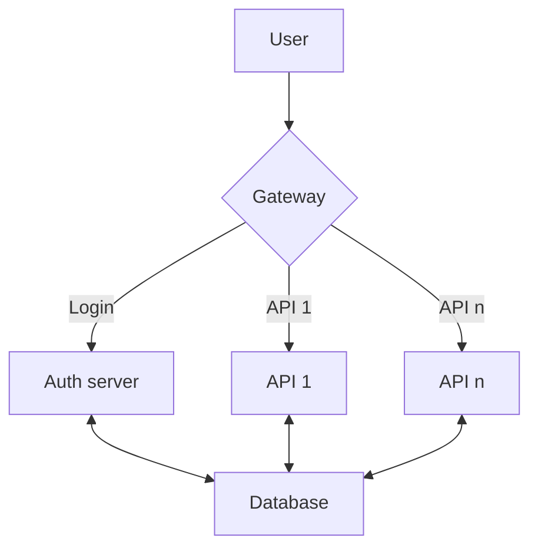

# bachelor-argocd-conf

This is the configuration for our GitOps continuous delivery tool for Kubernetes

### List of dockerhub repositories

| DockerHub repo                                                                           | Github repo | Description                                                                                                                          |
| ---------------------------------------------------------------------------------------- | ----------- | ------------------------------------------------------------------------------------------------------------------------------------ |
| [Gateway](https://hub.docker.com/repository/docker/danielneset/bachelor-gateway/general) | [Gateway]() | This application is used to route the user to their correct endpoint, and handle authentication when it comes to accessing the API´s |
| [Auth](https://hub.docker.com/repository/docker/danielneset/bachelor-auth/general)       | [Auth]()    | This application is used to authenticate users and give them access to their API´s and the data they have access to                  |

### FLow diagram

