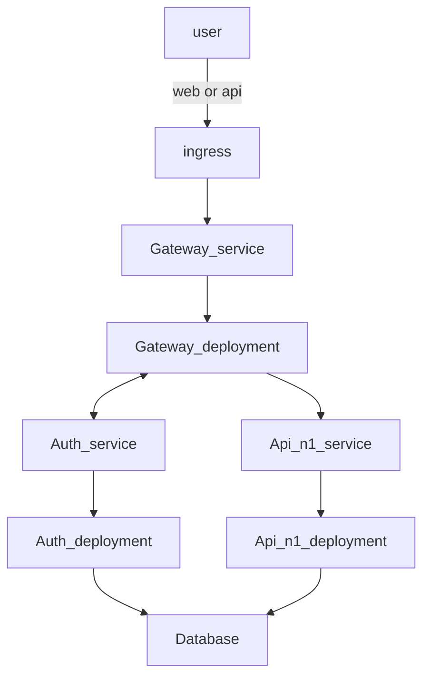

# Bachelor ArgoCD Configurations

This repository contains the Kubernetes manifests and Argo CD configuration files for our GitOps-based continuous delivery pipeline. All deployments and services are defined here, allowing us to manage, track, and version control changes to our environment.

- [Overview](#overview)
- [List of relevant repositories](#list-of-dockerhub-repositories)
- [FlowDiagram](#flow-diagram)

## Overview

We use [ArgoCD](https://argo-cd.readthedocs.io/en/stable/) as our GitOps operator to continuously syncronize Kubernetes manifests from this repository to our cluster. Changes merged into main will be automatically applied to the Kubernetes cluster.

Key Points:

- microk8s is our local Kubernetes distrobution of choice for quick testing, deployment and it suits our need.
- ArgoCD runs inside the cluster, watches this repo and ensure the desired stat is always reflected in the cluster.
- Multiple services (Gateway, REST API, Auth, etc) are each containerized and published to Docker Hub.

## List of Repositories

Below are the main Docker images and their respective GitHub repos. Each service has its own container image that is deployed via the manifests in this repo.

| DockerHub repo                                                                             | Github repo                                             | Description                                                                                                         |
| ------------------------------------------------------------------------------------------ | ------------------------------------------------------- | ------------------------------------------------------------------------------------------------------------------- |
| [Gateway](https://hub.docker.com/repository/docker/danielneset/bachelor-gateway/general)   | [Gateway](https://github.com/ADNTNU/bachelor-gateway)   | This application is a single point of entry where the user can be authenticated and directed to their desired route |
| [Auth](https://hub.docker.com/repository/docker/danielneset/bachelor-auth/general)         | [Auth](https://github.com/ADNTNU/bachelor-auth-service) | This application is used to authenticate and authorize users                                                        |
| [Rest API](https://hub.docker.com/repository/docker/danielneset/bachelor-rest-api/general) | [Rest API](https://github.com/ADNTNU/bachelor-rest-api) | This application is used to get, add, delete or update data                                                         |

## FLow diagram

This is a high level diagram that shows how traffic flows from the user to the Kubernetes cluster.

